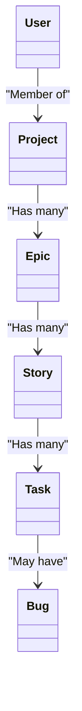

# 🚀 Project: Collaborative Project Management API (FastAPI + PostgreSQL + Docker + AWS EC2)

## 📌 Overview

This project is a **backend-only** implementation of a collaborative project management system inspired by **JIRA/Trello**.
It allows **teams** to create projects, invite members, and manage **Epics, Stories, Tasks, and Bugs**.
We’ll build this step-by-step in **5 tutorial parts**, explaining everything from setup to AWS deployment.

**Tech Stack:**

* **Backend Framework:** [FastAPI](https://fastapi.tiangolo.com/) (Python 3.11+)
* **Database:** PostgreSQL
* **Authentication:** JWT (JSON Web Token)
* **Containerization:** Docker & Docker Compose
* **Deployment:** AWS EC2
* **ORM:** SQLAlchemy + Alembic (for migrations)

---

## 📚 Tutorial Series

| Part       | Title                                                | Description                                                                                        |
| ---------- | ---------------------------------------------------- | -------------------------------------------------------------------------------------------------- |
| **Part 1** | **Project Setup & Architecture**                     | Setup FastAPI, PostgreSQL, Docker, and basic folder structure. Define requirements & UML diagrams. |
| **Part 2** | **User Management & Authentication**                 | Implement user registration, login, JWT authentication, and project invitation logic.              |
| **Part 3** | **Projects, Epics, Stories, Tasks & Bugs**           | Create database models, CRUD APIs, and relationships between entities.                             |
| **Part 4** | **Advanced Features: Filtering, Search, Pagination** | Implement search by title, filter by status, due date, and assigned user.                          |
| **Part 5** | **Deployment to AWS EC2**                            | Dockerize the app, push to EC2, set up environment variables & production database.                |

---

## 🛠 Features

✅ User Registration & Login (JWT Auth)
✅ Create & Manage Projects
✅ Invite Users to Projects
✅ Manage Epics, Stories, Tasks, Bugs
✅ Search & Filtering for work items
✅ Role-based Permissions (Owner, Member)
✅ PostgreSQL with Alembic migrations
✅ Dockerized for easy deployment
✅ AWS EC2 Production Setup

---

## 📐 System Design

### **1. UML Diagram — High Level**



---

### **2. Database Schema**

| Table                | Description                            |
| -------------------- | -------------------------------------- |
| **users**            | Stores registered user details.        |
| **projects**         | Stores project details and owner info. |
| **project\_members** | Mapping between users and projects.    |
| **epics**            | Large feature sets under projects.     |
| **stories**          | Stories under an Epic.                 |
| **tasks**            | Work items under a Story.              |
| **bugs**             | Bug reports under a Task.              |

---

## 🗂 Folder Structure

```
project-management-api/
│── app/
│   ├── main.py
│   ├── core/         # Config, settings
│   ├── models/       # SQLAlchemy models
│   ├── schemas/      # Pydantic schemas
│   ├── routes/       # API endpoints
│   ├── services/     # Business logic
│   ├── db/           # Database setup & migrations
│   ├── utils/        # Helper functions
│── alembic/          # Migration scripts
│── docker-compose.yml
│── Dockerfile
│── requirements.txt
│── README.md
```

---

## 🔑 API Specification (Example)

### **User Registration**

```http
POST /auth/register
Content-Type: application/json

{
  "username": "john_doe",
  "email": "john@example.com",
  "password": "secret123"
}
```

**Response**

```json
{
  "id": 1,
  "username": "john_doe",
  "email": "john@example.com"
}
```

### **Create Project**

```http
POST /projects/
Authorization: Bearer <JWT>
{
  "name": "Website Redesign",
  "description": "Redesign corporate website"
}
```

---

## ⚙️ Getting Started (Local Development)

### 1️⃣ Clone the Repository

```bash
git clone https://github.com/zakeer/task-management.git
cd task-management
```

### 2️⃣ Setup Environment Variables

Create a `.env` file:

```
DATABASE_URL=postgresql://postgres:password@db:5432/project_db
SECRET_KEY=supersecret
ALGORITHM=HS256
ACCESS_TOKEN_EXPIRE_MINUTES=30
```

### 3️⃣ Start Services with Docker

```bash
docker-compose up --build
```

### 4️⃣ Apply Database Migrations

```bash
docker-compose exec web alembic upgrade head
```

### 5️⃣ Access API Docs

* **Swagger UI:** `http://localhost:8000/docs`
* **ReDoc:** `http://localhost:8000/redoc`

---

## 🚀 Deployment to AWS EC2

1. Launch **EC2 Instance** (Ubuntu 22.04)
2. Install **Docker & Docker Compose**
3. Clone Repository & Configure `.env`
4. Run:

```bash
docker-compose up --build -d
```

5. Configure **NGINX** + SSL (optional for HTTPS)

---

## 📜 License

MIT License — You can freely use, modify, and distribute.
