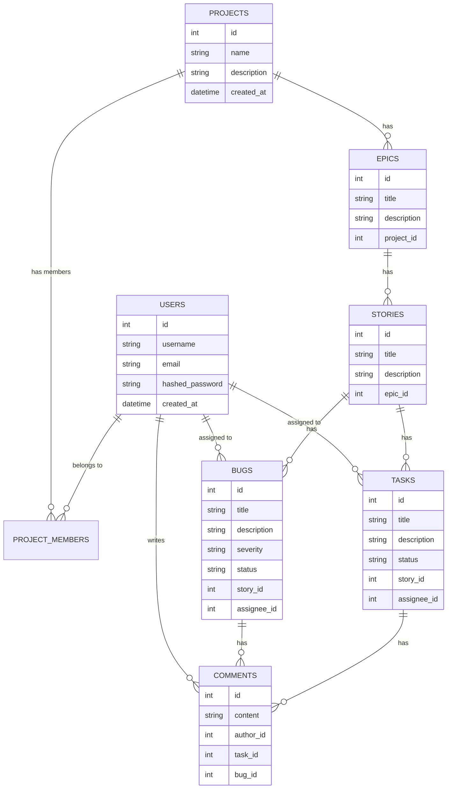

## 📚 Part 1 — Project Setup & Database Modeling

### 1. Introduction

In this series, we will build a **Jira/Trello-like Project Management Backend** using:

* **FastAPI** — high-performance Python web framework
* **PostgreSQL** — relational database
* **Docker** — containerization for easy setup and portability

This backend will support:

* User registration & authentication (JWT)
* Project creation & user invitations
* Project entities: **Epic → Stories → Tasks/Bugs**
* Filtering, searching, and assigning work

In **Part 1**, we will set up our environment, create database models, and run everything inside Docker.

---

### 2. Tech Stack Overview

| Technology     | Purpose                                 |
| -------------- | --------------------------------------- |
| **FastAPI**    | API framework for backend development   |
| **PostgreSQL** | Relational database for structured data |
| **SQLAlchemy** | ORM to interact with PostgreSQL         |
| **Pydantic**   | Data validation and serialization       |
| **Docker**     | Isolate and package the environment     |
| **Alembic**    | Database migrations                     |
| **PyJWT**      | Token-based authentication              |

---

### 3. Project Structure

We'll keep a clean, modular folder structure:

```
project-management-backend/
│── app/
│   ├── main.py              # FastAPI entry point
│   ├── database.py          # Database connection
│   ├── models/              # SQLAlchemy models
│   │   ├── user.py
│   │   ├── project.py
│   │   ├── epic.py
│   │   ├── story.py
│   │   ├── task.py
│   │   └── bug.py
│   ├── schemas/             # Pydantic schemas
│   ├── routers/             # API routes
│   ├── core/                # Config, security utils
│── docker-compose.yml
│── Dockerfile
│── requirements.txt
│── alembic/                 # Migrations
│── README.md
```

---

### 4. UML Diagram — Entities & Relationships



---

### 5. Database Schema Overview

| Table              | Description                        |
| ------------------ | ---------------------------------- |
| **users**          | Stores registered users            |
| **projects**       | Stores project details             |
| **project\_users** | Links users to projects with roles |
| **epics**          | High-level project objectives      |
| **stories**        | Work items under an epic           |
| **tasks**          | Actionable tasks under a story     |
| **bugs**           | Bugs linked to a story             |

---

### 6. Step-by-Step Environment Setup

#### **Step 1 — Create Project Folder**

```bash
mkdir project-management-backend
cd project-management-backend
```

#### **Step 2 — Create Virtual Environment (Optional if using Docker)**

```bash
python3 -m venv venv
source venv/bin/activate
```

#### **Step 3 — Install FastAPI & Dependencies**

```bash
pip install fastapi uvicorn psycopg2-binary sqlalchemy pydantic alembic python-jose passlib[bcrypt]
```

#### **Step 4 — Create `requirements.txt`**

```txt
fastapi
uvicorn
sqlalchemy
psycopg2-binary
pydantic
alembic
python-jose
passlib[bcrypt]
```

---

### 7. Docker Setup

#### **Dockerfile**

```dockerfile
FROM python:3.11-slim

WORKDIR /app

COPY requirements.txt .
RUN pip install --no-cache-dir -r requirements.txt

COPY . .

CMD ["uvicorn", "app.main:app", "--host", "0.0.0.0", "--port", "8000"]
```

#### **docker-compose.yml**

```yaml
version: "3.8"

services:
  db:
    image: postgres:15
    environment:
      POSTGRES_USER: admin
      POSTGRES_PASSWORD: admin
      POSTGRES_DB: project_management
    ports:
      - "5432:5432"
    volumes:
      - postgres_data:/var/lib/postgresql/data

  web:
    build: .
    depends_on:
      - db
    environment:
      DATABASE_URL: postgres://admin:admin@db:5432/project_management
    ports:
      - "8000:8000"
    volumes:
      - .:/app
    command: uvicorn app.main:app --host 0.0.0.0 --port 8000 --reload

volumes:
  postgres_data:
```

---

### 8. FastAPI Basic Setup

#### **app/main.py**

```python
from fastapi import FastAPI
from .database import engine
from . import models

app = FastAPI(title="Project Management API")

models.Base.metadata.create_all(bind=engine)

@app.get("/")
def root():
    return {"message": "Project Management API is running"}
```

#### **app/database.py**

```python
from sqlalchemy import create_engine
from sqlalchemy.ext.declarative import declarative_base
from sqlalchemy.orm import sessionmaker
import os

DATABASE_URL = os.getenv("DATABASE_URL", "postgresql://admin:admin@db:5432/project_management")

engine = create_engine(DATABASE_URL)
SessionLocal = sessionmaker(autocommit=False, autoflush=False, bind=engine)

Base = declarative_base()
```

---

### 9. SQLAlchemy Models


```python
from sqlalchemy import Column, String, Integer, ForeignKey, DateTime, Enum, Text, Table
from sqlalchemy.orm import relationship
from datetime import datetime
import enum
from app.database import Base

# ---------- ENUMS ----------
class BugSeverity(str, enum.Enum):
    low = "low"
    medium = "medium"
    high = "high"
    critical = "critical"

class TaskStatus(str, enum.Enum):
    todo = "To Do"
    in_progress = "In Progress"
    done = "Done"

# ---------- ASSOCIATION TABLE ----------
project_members = Table(
    "project_members",
    Base.metadata,
    Column("user_id", Integer, ForeignKey("users.id", ondelete="CASCADE")),
    Column("project_id", Integer, ForeignKey("projects.id", ondelete="CASCADE"))
)

# ---------- USER ----------
class User(Base):
    __tablename__ = "users"
    
    id = Column(Integer, primary_key=True, index=True)
    username = Column(String, unique=True, nullable=False, index=True)
    email = Column(String, unique=True, nullable=False, index=True)
    hashed_password = Column(String, nullable=False)
    created_at = Column(DateTime, default=datetime.utcnow)

    projects = relationship("Project", secondary=project_members, back_populates="members")
    tasks = relationship("Task", back_populates="assignee")
    bugs = relationship("Bug", back_populates="assignee")
    comments = relationship("Comment", back_populates="author")

# ---------- PROJECT ----------
class Project(Base):
    __tablename__ = "projects"
    
    id = Column(Integer, primary_key=True, index=True)
    name = Column(String, nullable=False)
    description = Column(Text)
    created_at = Column(DateTime, default=datetime.utcnow)

    members = relationship("User", secondary=project_members, back_populates="projects")
    epics = relationship("Epic", back_populates="project")

# ---------- EPIC ----------
class Epic(Base):
    __tablename__ = "epics"
    
    id = Column(Integer, primary_key=True, index=True)
    title = Column(String, nullable=False)
    description = Column(Text)
    project_id = Column(Integer, ForeignKey("projects.id", ondelete="CASCADE"))
    created_at = Column(DateTime, default=datetime.utcnow)

    project = relationship("Project", back_populates="epics")
    stories = relationship("Story", back_populates="epic")

# ---------- STORY ----------
class Story(Base):
    __tablename__ = "stories"
    
    id = Column(Integer, primary_key=True, index=True)
    title = Column(String, nullable=False)
    description = Column(Text)
    epic_id = Column(Integer, ForeignKey("epics.id", ondelete="CASCADE"))
    created_at = Column(DateTime, default=datetime.utcnow)

    epic = relationship("Epic", back_populates="stories")
    tasks = relationship("Task", back_populates="story")
    bugs = relationship("Bug", back_populates="story")

# ---------- TASK ----------
class Task(Base):
    __tablename__ = "tasks"
    
    id = Column(Integer, primary_key=True, index=True)
    title = Column(String, nullable=False)
    description = Column(Text)
    status = Column(Enum(TaskStatus), default=TaskStatus.todo)
    story_id = Column(Integer, ForeignKey("stories.id", ondelete="CASCADE"))
    assignee_id = Column(Integer, ForeignKey("users.id", ondelete="SET NULL"))
    created_at = Column(DateTime, default=datetime.utcnow)

    story = relationship("Story", back_populates="tasks")
    assignee = relationship("User", back_populates="tasks")
    comments = relationship("Comment", back_populates="task")

# ---------- BUG ----------
class Bug(Base):
    __tablename__ = "bugs"
    
    id = Column(Integer, primary_key=True, index=True)
    title = Column(String, nullable=False)
    description = Column(Text)
    severity = Column(Enum(BugSeverity), default=BugSeverity.medium)
    status = Column(Enum(TaskStatus), default=TaskStatus.todo)
    story_id = Column(Integer, ForeignKey("stories.id", ondelete="CASCADE"))
    assignee_id = Column(Integer, ForeignKey("users.id", ondelete="SET NULL"))
    created_at = Column(DateTime, default=datetime.utcnow)

    story = relationship("Story", back_populates="bugs")
    assignee = relationship("User", back_populates="bugs")
    comments = relationship("Comment", back_populates="bug")

# ---------- COMMENT ----------
class Comment(Base):
    __tablename__ = "comments"
    
    id = Column(Integer, primary_key=True, index=True)
    content = Column(Text, nullable=False)
    created_at = Column(DateTime, default=datetime.utcnow)
    author_id = Column(Integer, ForeignKey("users.id", ondelete="CASCADE"))
    task_id = Column(Integer, ForeignKey("tasks.id", ondelete="CASCADE"), nullable=True)
    bug_id = Column(Integer, ForeignKey("bugs.id", ondelete="CASCADE"), nullable=True)

    author = relationship("User", back_populates="comments")
    task = relationship("Task", back_populates="comments")
    bug = relationship("Bug", back_populates="comments")
```

---

### 10. Running the Project

```bash
docker-compose up --build
```

Visit: **[http://localhost:8000](http://localhost:8000)**
Swagger Docs: **[http://localhost:8000/docs](http://localhost:8000/docs)**


