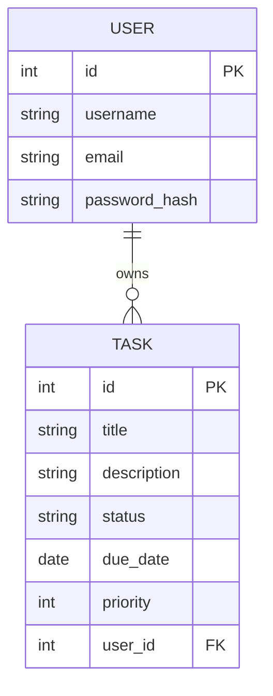

# Part 1: Planning & Project Setup

## 1. Project Overview

This project is a **Task Management REST API** built with FastAPI, PostgreSQL, and Docker. It allows users to:
- Register and log in
- Create, read, update, and delete tasks
- Filter and search tasks
- Deploy on AWS EC2

---

## 2. Requirements

### Functional
1. User registration & login (JWT)
2. Task CRUD operations
3. Task search & filtering
4. API documentation (Swagger/OpenAPI)
5. Ownership restriction (users can only manage their tasks)

### Non-Functional
- **Performance:** API responds within <200ms
- **Security:** JWT tokens, hashed passwords, HTTPS in production
- **Scalability:** Dockerized deployment
- **Maintainability:** Modular architecture
- **Monitoring:** Basic logging

---

## 3. Workflow Diagram

```mermaid
flowchart LR
    A[User] -->|HTTP Request| B[FastAPI API]
    B -->|SQL Queries| C[(PostgreSQL DB)]
    B -->|JWT Validation| A
    subgraph Deployment
        B
        C
    end
````

---

## 4. Use Case Diagram

```mermaid
graph TD
    User((User))
    UC1([Register])
    UC2([Login])
    UC3([Create Task])
    UC4([Update Task])
    UC5([Delete Task])
    UC6([Filter/Search Tasks])

    User --> UC1
    User --> UC2
    User --> UC3
    User --> UC4
    User --> UC5
    User --> UC6
```

---

## 5. Database Schema Diagram



---

## 6. Local Environment Setup

### Install Requirements

* **Python 3.11+**
* **PostgreSQL**
* **Docker & Docker Compose**
* **Git**

### Project Initialization

```bash
mkdir task-management && cd task-management

# Create virtual environment
python -m venv venv

source venv/bin/activate  # On Windows use venv\Scripts\activate

# Install dependencies
pip install fastapi uvicorn sqlalchemy psycopg2-binary alembic bcrypt python-jose python-dotenv
```

---

## 7. Project Structure

```
app/
  core/       # Config & dependencies
  models/     # SQLAlchemy models
  schemas/    # Pydantic schemas
  routes/     # API endpoints
  services/   # Business logic
  main.py     # Entry point
```

---

## 8. First Endpoint Example

```python
# app/main.py
from fastapi import FastAPI

app = FastAPI()

@app.get("/health")
def health_check():
    return {"status": "ok"}
```

Run:

```bash
uvicorn app.main:app --reload
```

Visit: [http://127.0.0.1:8000/health](http://127.0.0.1:8000/health)

---
